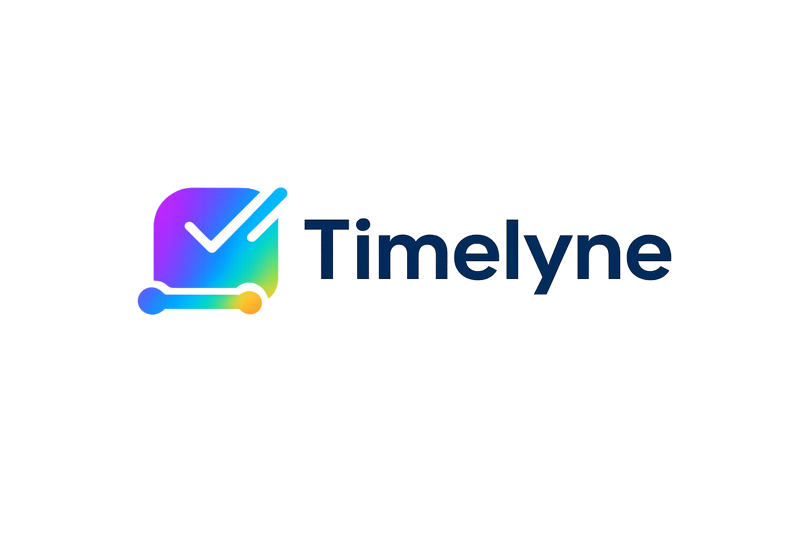

<!-- Improved compatibility of back to top link -->
<a id="readme-top"></a>

<!-- PROJECT SHIELDS -->
[![Contributors][contributors-shield]][contributors-url]
[![Forks][forks-shield]][forks-url]
[![Stargazers][stars-shield]][stars-url]
[![Issues][issues-shield]][issues-url]
[![LinkedIn][linkedin-shield]][linkedin-url]


<!-- PROJECT LOGO -->
<br />
<div align="center">
  <a href="https://github.com/doganaybalaban/timelyne">
    
  </a>

<h3 align="center">Timelyne</h3>

  <p align="center">
    Manage your freelance business in under 10 minutes a day.
    <br />
    <a href="https://github.com/doganaybalaban/timelyne"><strong>Explore the docs »</strong></a>
    <br />
    <br />
    <a href="https://github.com/doganaybalaban/timelyne">View Demo</a>
    &middot;
    <a href="https://github.com/doganaybalaban/timelyne/issues/new?labels=bug&template=bug-report---.md">Report Bug</a>
    &middot;
    <a href="https://github.com/doganaybalaban/timelyne/issues/new?labels=enhancement&template=feature-request---.md">Request Feature</a>
  </p>
</div>


<!-- TABLE OF CONTENTS -->
<details>
  <summary>Table of Contents</summary>
  <ol>
    <li>
      <a href="#about-the-project">About The Project</a>
      <ul>
        <li><a href="#built-with">Built With</a></li>
      </ul>
    </li>
    <li>
      <a href="#getting-started">Getting Started</a>
      <ul>
        <li><a href="#prerequisites">Prerequisites</a></li>
        <li><a href="#installation">Installation</a></li>
      </ul>
    </li>
    <li><a href="#usage">Usage</a></li>
    <li><a href="#features">Features</a></li>
    <li><a href="#roadmap">Roadmap</a></li>
    <li><a href="#contributing">Contributing</a></li>
    <li><a href="#license">License</a></li>
    <li><a href="#contact">Contact</a></li>
    <li><a href="#acknowledgments">Acknowledgments</a></li>
  </ol>
</details>


<!-- ABOUT THE PROJECT -->
## About The Project

[![Timelyne Screen Shot][product-screenshot]](https://github.com/doganaybalaban/timelyne)

Timelyne is an **all-in-one SaaS platform** designed for freelancers and small agencies to replace scattered tools like Excel, Word, and WhatsApp with a single, professional workspace. It helps you track time, manage projects and clients, automate invoicing, and gain clear financial insights — all through a timeline-driven experience.

**Our core promise:**

> *Running your freelance business should never take more than 10 minutes a day.*

<p align="right">(<a href="#readme-top">back to top</a>)</p>


### Built With

* [![Next][Next.js]][Next-url]
* [![React][React.js]][React-url]
* [![TypeScript][TypeScript]][TypeScript-url]
* [![Node.js][Node.js]][Node-url]
* [![Express][Express.js]][Express-url]
* [![PostgreSQL][PostgreSQL]][PostgreSQL-url]
* [![Prisma][Prisma]][Prisma-url]
* [![TailwindCSS][TailwindCSS]][TailwindCSS-url]

<p align="right">(<a href="#readme-top">back to top</a>)</p>


<!-- GETTING STARTED -->
## Getting Started

To get a local copy up and running follow these simple steps.

### Prerequisites

* Node.js (v18 or higher)
* npm or yarn
* PostgreSQL database
* Redis (optional, for caching)

```sh
npm install npm@latest -g
```

### Installation

1. Clone the repo
   ```sh
   git clone https://github.com/doganaybalaban/timelyne.git
   ```
2. Install server dependencies
   ```sh
   cd server
   npm install
   ```
3. Install client dependencies
   ```sh
   cd ../client
   npm install
   ```
4. Configure environment variables
   ```sh
   # Server: copy .env.example to .env and fill in your values
   cp server/.env.example server/.env
   
   # Client: copy .env.local.example to .env.local
   cp client/.env.local.example client/.env.local
   ```
5. Set up the database
   ```sh
   cd server
   npx prisma migrate dev
   npx prisma generate
   ```
6. Start the development servers
   ```sh
   # Terminal 1 - Server
   cd server && npm run dev
   
   # Terminal 2 - Client
   cd client && npm run dev
   ```

### 🐳 Run with Docker

Alternatively, you can run the entire stack using Docker:

1. Configure environment variables
   ```sh
   # Copy the example docker environment file
   cp .env.docker.example .env
   # Edit .env with your configuration
   ```

2. Build and start containers
   ```sh
   docker-compose up --build
   ```

3. Access the application
   - Client: http://localhost:3000
   - Server: http://localhost:5001

<p align="right">(<a href="#readme-top">back to top</a>)</p>


<!-- USAGE EXAMPLES -->
## Usage

Timelyne is designed to be a **digital assistant** for freelancers:

* You focus on your craft
* Timelyne tracks time in the background
* Generates invoices automatically
* Follows up on payments
* Shows you exactly how much you earned

No clutter. No unnecessary features. Just what you need.

<p align="right">(<a href="#readme-top">back to top</a>)</p>


<!-- FEATURES -->
## Features

### ⏱️ Time Tracking
* One-click timer per project or task
* Billable & non-billable time categorization
* Accurate work logs tied directly to clients and projects

### 🧾 Automated Invoicing
* Generate professional PDF invoices automatically
* Tax-aware calculations (VAT, withholding, etc.)
* Convert tracked hours directly into invoices

### 📁 Project & Client Management
* Centralized client database
* Project budgets and progress tracking
* Kanban-style task management
* File storage per project

### 📊 Financial Insights
* Monthly income summaries
* Outstanding payments tracking
* Most profitable clients & projects
* Timeline-based financial dashboard

### 🧠 Timeline-Driven Workflow
* All actions (time, tasks, invoices, payments) live on a single timeline
* Clear overview of past, present, and upcoming work

<p align="right">(<a href="#readme-top">back to top</a>)</p>


<!-- ROADMAP -->
## Roadmap

- [x] Authentication & user onboarding
- [ ] Time tracking MVP
- [ ] Client & project management
- [ ] Automated invoicing
- [ ] Financial dashboard
- [ ] Team support for small agencies

See the [open issues](https://github.com/doganaybalaban/timelyne/issues) for a full list of proposed features (and known issues).

<p align="right">(<a href="#readme-top">back to top</a>)</p>


<!-- CONTRIBUTING -->
## Contributing

This project is currently not open for external contributions.

If you have a suggestion that would make this better, please fork the repo and create a pull request. You can also simply open an issue with the tag "enhancement".

1. Fork the Project
2. Create your Feature Branch (`git checkout -b feature/AmazingFeature`)
3. Commit your Changes (`git commit -m 'Add some AmazingFeature'`)
4. Push to the Branch (`git push origin feature/AmazingFeature`)
5. Open a Pull Request

<p align="right">(<a href="#readme-top">back to top</a>)</p>

### Top contributors:

<a href="https://github.com/doganaybalaban/timelyne/graphs/contributors">
  
</a>


<!-- LICENSE -->
## License

This project is proprietary and not licensed for redistribution or commercial use at this stage.

<p align="right">(<a href="#readme-top">back to top</a>)</p>


<!-- CONTACT -->
## Contact

Doğanay Balaban - [@doganaybalaban](https://github.com/doganaybalaban)

Project Link: [https://github.com/doganaybalaban/timelyne](https://github.com/doganaybalaban/timelyne)

<p align="right">(<a href="#readme-top">back to top</a>)</p>


<!-- ACKNOWLEDGMENTS -->
## Acknowledgments

* [Best-README-Template](https://github.com/othneildrew/Best-README-Template)
* [Shields.io](https://shields.io)
* [Img Shields](https://shields.io)

<p align="right">(<a href="#readme-top">back to top</a>)</p>

---

> Built with ❤️ for freelancers who value their time.


<!-- MARKDOWN LINKS & IMAGES -->
<!-- https://www.markdownguide.org/basic-syntax/#reference-style-links -->
[contributors-shield]: https://img.shields.io/github/contributors/doganaybalaban/timelyne.svg?style=for-the-badge
[contributors-url]: https://github.com/doganaybalaban/timelyne/graphs/contributors
[forks-shield]: https://img.shields.io/github/forks/doganaybalaban/timelyne.svg?style=for-the-badge
[forks-url]: https://github.com/doganaybalaban/timelyne/network/members
[stars-shield]: https://img.shields.io/github/stars/doganaybalaban/timelyne.svg?style=for-the-badge
[stars-url]: https://github.com/doganaybalaban/timelyne/stargazers
[issues-shield]: https://img.shields.io/github/issues/doganaybalaban/timelyne.svg?style=for-the-badge
[issues-url]: https://github.com/doganaybalaban/timelyne/issues
[linkedin-shield]: https://img.shields.io/badge/-LinkedIn-black.svg?style=for-the-badge&logo=linkedin&colorB=555
[linkedin-url]: https://linkedin.com/in/doganaybalaban
[product-screenshot]: images/screenshot.png

<!-- Tech Stack Badges -->
[Next.js]: https://img.shields.io/badge/next.js-000000?style=for-the-badge&logo=nextdotjs&logoColor=white
[Next-url]: https://nextjs.org/
[React.js]: https://img.shields.io/badge/React-20232A?style=for-the-badge&logo=react&logoColor=61DAFB
[React-url]: https://reactjs.org/
[TypeScript]: https://img.shields.io/badge/TypeScript-007ACC?style=for-the-badge&logo=typescript&logoColor=white
[TypeScript-url]: https://www.typescriptlang.org/
[Node.js]: https://img.shields.io/badge/Node.js-43853D?style=for-the-badge&logo=node.js&logoColor=white
[Node-url]: https://nodejs.org/
[Express.js]: https://img.shields.io/badge/Express.js-404D59?style=for-the-badge&logo=express&logoColor=white
[Express-url]: https://expressjs.com/
[PostgreSQL]: https://img.shields.io/badge/PostgreSQL-316192?style=for-the-badge&logo=postgresql&logoColor=white
[PostgreSQL-url]: https://www.postgresql.org/
[Prisma]: https://img.shields.io/badge/Prisma-3982CE?style=for-the-badge&logo=Prisma&logoColor=white
[Prisma-url]: https://www.prisma.io/
[TailwindCSS]: https://img.shields.io/badge/Tailwind_CSS-38B2AC?style=for-the-badge&logo=tailwind-css&logoColor=white
[TailwindCSS-url]: https://tailwindcss.com/
